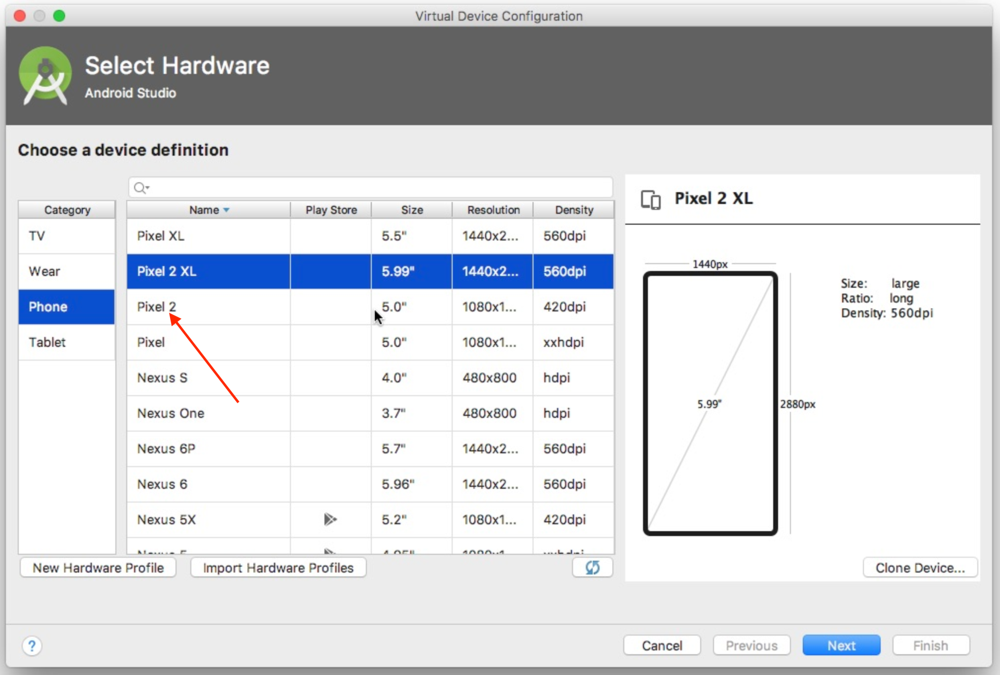

# Setup

Make sure you're running on a macOS computer running Mojave or Catalina.

 

**Engineers**: Please follow Steps 3 and 4.

**Non-Engineers**: Please follow all steps.

 

## 1. Install Xcode

It is _very important_ that we are all using the same version of Xcode. Our mobile codebase currently expect us to be on Xcode 11.2.1.

In order to install Xcode, _**do not**_ install it from the App Store since this can trigger automatic version updates in the future that might not be compatible with our codebase.

* Install Xcode using [this link](https://www.dropbox.com/s/oegetvzr55fpfpk/Xcode_11.2.1.xip?dl=0)
* Drag Xcode to your `Applications` folder
* Start Xcode
	- The first time you open it, it might ask you to agree to the License Agreement. 
	
	**Select AGREE**

	

	 

	- The first time you open it, it might ask you if you want to install additional components
	
	**Select INSTALL.**

	
* Xcode is now configured! Feel free to close it.

 
 

## 2. Install Android Studio

* Download Android Studio using [this link](https://redirector.gvt1.com/edgedl/android/studio/install/3.6.3.0/android-studio-ide-192.6392135-mac.dmg)
* Drag Android Studio to your `Applications` folder
* Start Android Studio
	* Go through the Android Studio Setup Wizard

	You can simply accept all of the default options and click **Next** on each screen.

	

	 

	* Once the setup process is finished you will be presented with this screen.

	**Click on the Configure Button, then select SDK Manager** 

	

	* Check the boxes for:
		- Android 10.0 (Q)
		- Android 9.0 (Pie)

	Then click **OK**, this will install the corresponding Android versions.

	 

	* Once the install completes. You will be presented with the same screen again. 

	**Click on the Configure Button, then select SDK Manager once more**

	

	 

	* This time click on SDK Tools:

	

	* Check the boxes for:
		- Android SDK Build-Tools
		- Android SDK Platform-Tools
		- Android SDK Tools
		- Android Emulator
		- Intel x86 Emulator Accelerator (HAXM installer)

	Then click **OK** and wait for the installation to complete.

	 

	* Once the install completes. You will be presented with the same screen again. 

	**Click on Import an Android code sample**

	

	* Select any of the options from the list (it doesn't matter which one)
	* Click **Next**
	* Click **Finish**

	 

	* Open the AVD (Android Virtual Device) manager by pressing the following button in the toolbar:

	

	 

	* Click on **Create Virtual Device**

	

	 

	* Select **Pixel 2**
	* Click **Next**

	

	 

	* Click on **x86 Images**
	* Click **Q**
	* Click **Next**

	

	 

	* A new screen will appear, Click **Finish**

	* Android Studio is now configured! Feel free to close it.

 
 

## 3. Install Flutter
- Engineers:
	- Follow instructions [here](https://github.com/Betterment/mobile/tree/master/flutter#getting-started)

 

- Non-engineers:
	- Download [this zip file](#todo) and store it in `/Downloads/setup.zip`
	- Double click on the zip file to uncompress it
	- Select **Go**, then **Utilities** from the top menu

	

	 

	- Then double click on **Terminal** to open it

	

	 

	- You should now see something like this:

	

	 

	- Type the following commands:

		- `cd ~/Downloads/setup`
		- Press Enter

		 

		- `sudo gem install cocoapods`
		- Press Enter
		- You will now be prompted for your password. Please type your password and press enter.
		(Note that as you type you will not see any characters being updated - but your password is still being recorded, so continue typing.)
		- Once the installation completes, move on to the next step.

		 

		- `./setup.sh`
		- Press Enter
		- Once the installation completes, move on to the next step.

		 

		- `flutter doctor`
		- Press Enter
		- Make sure that this is what you see.

         

		If "No issues found!" is shown then you are all done setting up Flutter!

		

 
 

## 4. Configure Android Studio for Flutter

- Open Android Studio

**Click on the Configure Button, then select Preferences**

 
 

- Click on Plugins
- Click on Marketplace
- Type in Flutter and press enter
- Click on Install

You will be asked if you want to install the Dart plugin. **Click YES**

When prompted, **click RESTART**

 
Once the installation is done, feel free to close Android Studio.

 
 

## 5. Rejoice

Phew, that was a lot! 

